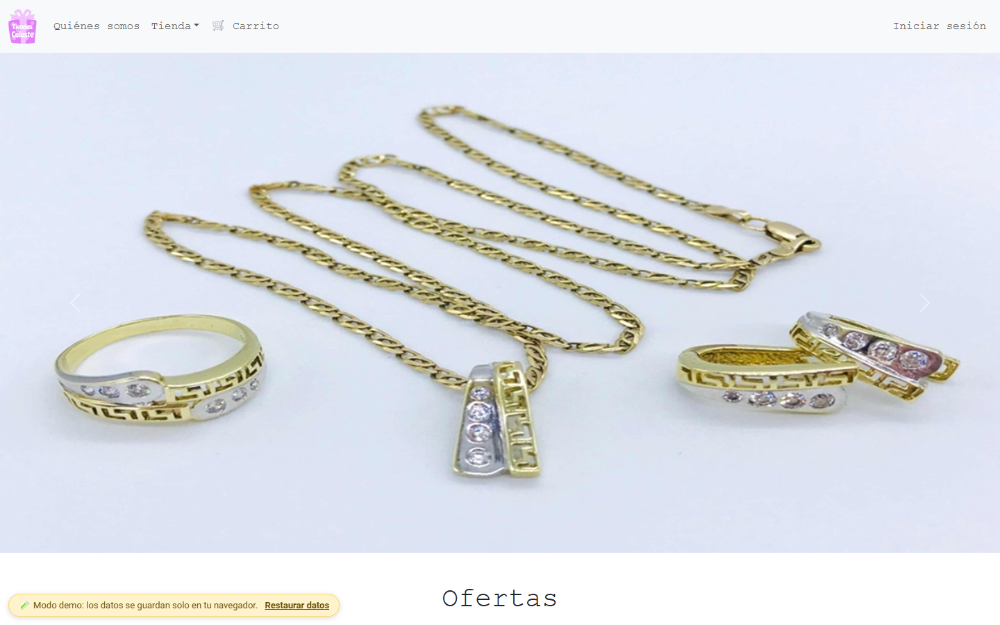
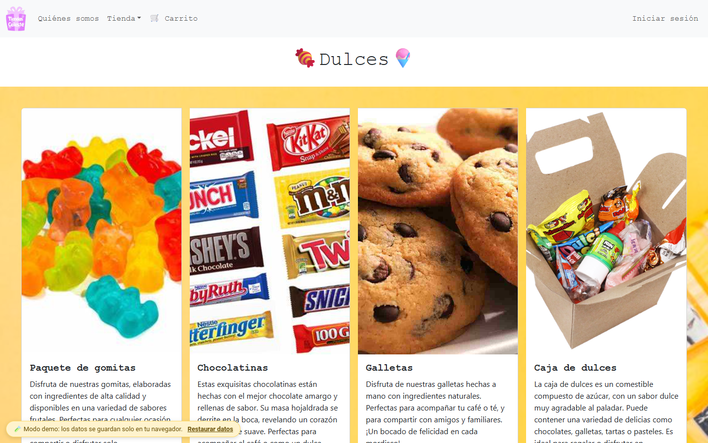
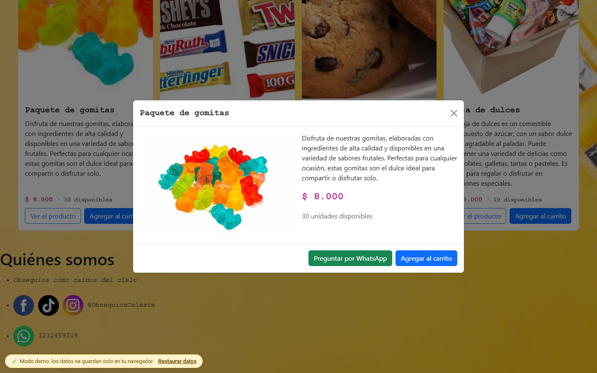
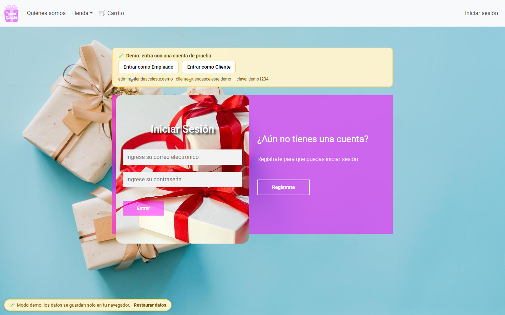
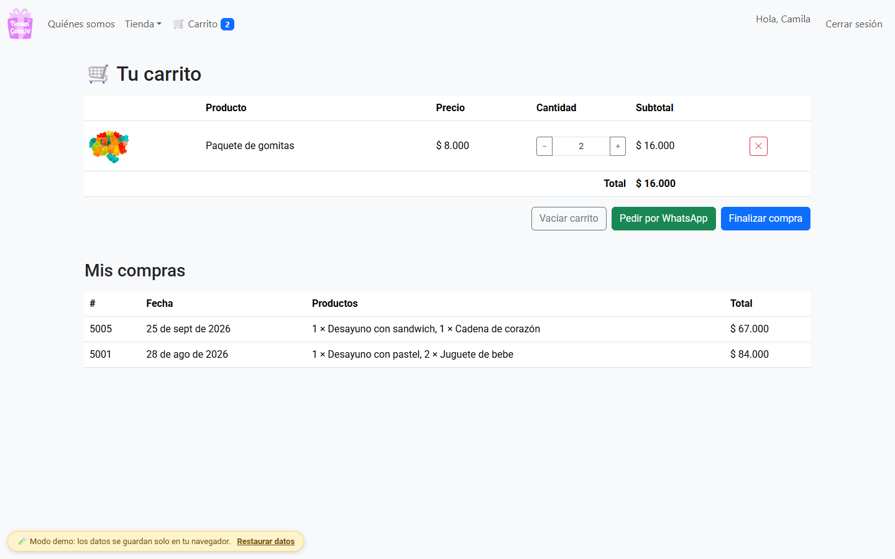
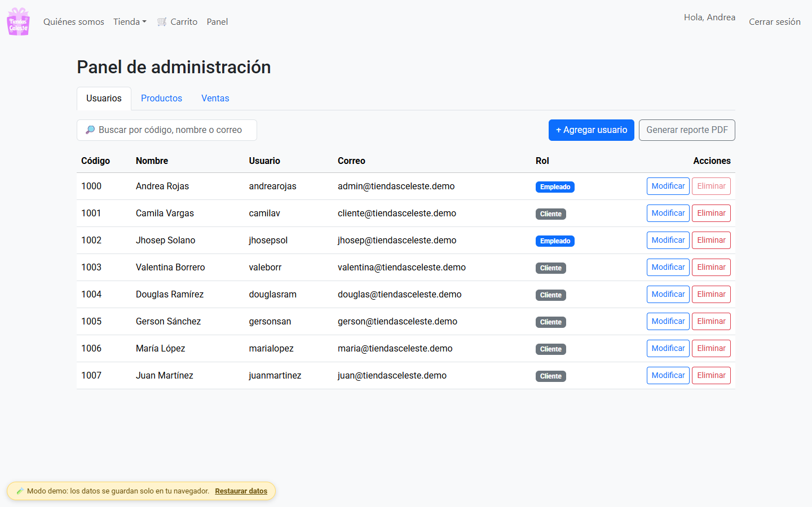
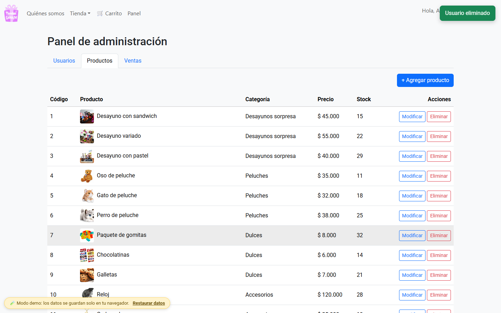
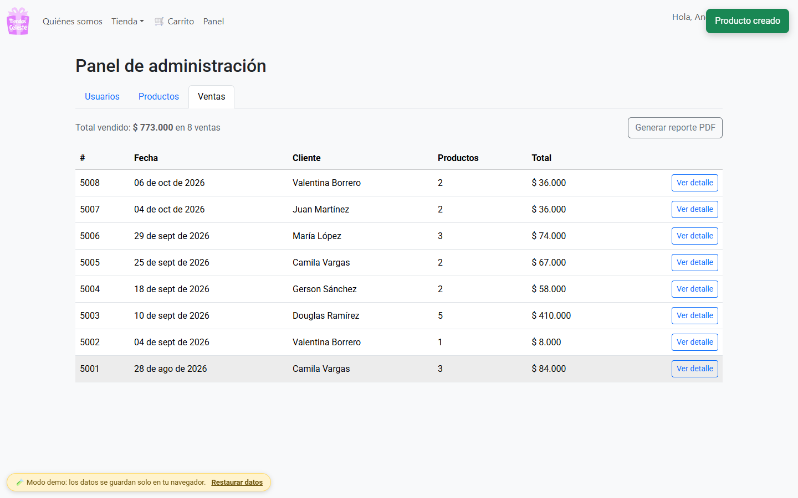

<div align="center">

# 🎁 Tiendas Celeste

**Obsequios como caídos del cielo** — tienda en línea de desayunos sorpresa, peluches, dulces, accesorios, juguetes, maquillaje y regalos.

[](https://cabrales16.github.io/Tiendas-Celeste/)




</div>

---

## 📑 Contenido

- [Dos versiones del proyecto](#-dos-versiones-del-proyecto)
- [Demo en vivo](#-demo-en-vivo)
- [Galería](#-galería)
- [Funcionalidades](#-funcionalidades)
- [Estructura](#-estructura-del-proyecto)
- [Ejecutar la versión PHP](#-ejecutar-la-versión-php)
- [Despliegue de la demo](#-despliegue-de-la-demo)
- [Mejoras y correcciones](#-mejoras-y-correcciones)
- [Estado del proyecto](#-estado-del-proyecto)

## 🧭 Dos versiones del proyecto

GitHub Pages solo sirve archivos estáticos y **no ejecuta PHP**. Por eso el repositorio incluye dos versiones que comparten los mismos estilos e imágenes (`assets/`):

| | Versión PHP (original) | Demo estática |
|---|---|---|
| Carpeta | raíz (`*.php`, `CRUD/`, `php/`) | [`demo/`](demo/) |
| Backend | PHP + MySQL | JavaScript + `localStorage` (simula la base de datos) |
| Dónde corre | XAMPP / Docker / hosting con PHP | Cualquier servidor estático, p. ej. GitHub Pages |
| Para qué | Producción / aprendizaje de PHP | Probar todo sin instalar nada |

## 🎮 Demo en vivo

👉 **https://cabrales16.github.io/Tiendas-Celeste/**

No necesita servidor: los datos se guardan solo en tu navegador y puedes restaurarlos con **«Restaurar datos»** (esquina inferior izquierda).

| Perfil | Correo | Contraseña |
|---|---|---|
| 🧑‍💼 Empleado (acceso al panel) | `admin@tiendasceleste.demo` | `demo1234` |
| 🛍️ Cliente | `cliente@tiendasceleste.demo` | `demo1234` |

La pantalla de inicio de sesión tiene botones de acceso rápido y también puedes **registrarte** con tu propio correo.

**Qué probar**

| Como cliente | Como empleado |
|---|---|
| Navegar las 7 categorías y abrir el detalle de un producto | Gestionar **usuarios**: crear, modificar, eliminar y buscar |
| Agregar productos al **carrito** y ajustar cantidades | Gestionar **productos**: precios, stock, categoría y ofertas |
| **Finalizar la compra** (descuenta stock y queda en «Mis compras») | Ver las **ventas** y su detalle (incluida la que acabas de hacer como cliente) |
| Pedir por **WhatsApp** con el resumen del carrito | Descargar **reportes PDF** de usuarios y de ventas |

> 💡 Abre dos ventanas (una como cliente y otra como empleado) para ver el flujo completo. Los precios y el inventario de la demo son ficticios.

## 🖼️ Galería

| Categorías | Detalle de producto |
|:---:|:---:|
|  |  |
| **Inicio de sesión / registro** | **Carrito** |
|  |  |
| **Panel · usuarios** | **Panel · productos** |
|  |  |



## 🚀 Funcionalidades

**Tienda (ambas versiones)**
- Catálogo por categorías: desayunos, peluches, dulces, accesorios, juguetes, maquillaje y regalos.
- Registro e inicio de sesión de clientes.
- Redes sociales y datos de contacto de la tienda.

**Solo en la demo**
- Carrito de compras, compra con control de stock e historial «Mis compras».
- Panel de empleados con CRUD de usuarios y productos, listado de ventas y reportes PDF (jsPDF).

**Solo en la versión PHP**
- CRUD de usuarios con búsqueda, roles y reporte PDF (FPDF), restringido a empleados.

## 🗂️ Estructura del proyecto

```
Tiendas-Celeste/
├── assets/            # CSS, JS e imágenes compartidos por ambas versiones
├── demo/              # Demo estática (HTML + JS modular, sin backend)
│   ├── js/            # db.js (BD en localStorage), auth, carrito, panel, catálogo semilla
│   └── css/demo.css
├── CRUD/              # Panel PHP de usuarios (+ FPDF para el PDF)
├── php/               # Conexión, autenticación, login y registro (PHP)
├── *.php              # Páginas de la tienda (versión PHP)
├── tiendasceleste1.sql        # Esquema y datos de ejemplo (MySQL/MariaDB)
├── Dockerfile · docker-compose.yml
└── .github/workflows/         # Publicación de la demo en GitHub Pages
```

## 🛠️ Ejecutar la versión PHP

### Opción A · Docker

```bash
docker compose up --build
```

Tienda en http://localhost:8080 (la base de datos se crea e importa sola la primera vez). Cuenta de prueba: `andrescab@tiendasceleste.demo` / `demo1234` (empleado).

### Opción B · XAMPP

1. Copia la carpeta del proyecto en `C:\xampp\htdocs\` e inicia **Apache** y **MySQL**.
2. Importa `tiendasceleste1.sql` en phpMyAdmin (crea la base `tiendasceleste1`).
3. Abre http://localhost/Tiendas-Celeste/login.php.

La conexión está en [`php/conexion_be.php`](php/conexion_be.php) y se configura con las variables de entorno `DB_HOST`, `DB_USER`, `DB_PASS` y `DB_NAME` (por defecto, los valores de XAMPP).

> **Requisitos:** PHP 8.0 o superior con la extensión `mysqli`.
> **Hosting gratuito:** si no permite procedimientos almacenados, elimina los bloques `CREATE PROCEDURE` del SQL (la aplicación no los usa) y ajusta las credenciales.

## 🌐 Despliegue de la demo

El workflow [`jekyll-gh-pages.yml`](.github/workflows/jekyll-gh-pages.yml) copia `demo/` y `assets/`, y los publica con el pipeline de **Jekyll** de GitHub Pages en cada push a `main`.

1. En el repositorio: **Settings → Pages → Source: GitHub Actions**.
2. Haz push a `main` (o lanza el workflow desde la pestaña *Actions*).
3. La demo queda en `https://<usuario>.github.io/Tiendas-Celeste/`.

Para probarla en local, sirve la raíz del repositorio con cualquier servidor estático y abre `/demo/`:

```bash
npx serve .          # o:  python -m http.server 8000
```

> Hace falta un servidor (no basta con abrir el HTML) porque la demo usa módulos ES.

## 🔧 Mejoras y correcciones

**Seguridad (versión PHP)**
- Consultas con *prepared statements*: se eliminó la inyección SQL en login, registro y CRUD.
- Las contraseñas ahora se guardan con `password_hash` (antes, en texto plano). Las cuentas antiguas se migran solas en su primer inicio de sesión.
- El CRUD de usuarios estaba abierto a cualquiera: ahora exige sesión y rol **Empleado**.
- Eliminar usuarios pasó de un enlace GET a un formulario POST con token **CSRF**; no se puede eliminar la propia cuenta.
- Salida escapada (`htmlspecialchars`) contra XSS y regeneración del id de sesión al entrar.
- El reporte PDF ya no imprime las contraseñas.
- El volcado SQL ya no contiene correos ni contraseñas reales: usa datos ficticios con contraseña `demo1234` (hash bcrypt).

**Errores corregidos**
- `registro_usuario_be.php` tenía un `else` mal escrito que ocultaba los errores al guardar.
- `editar.php` incluía a `index.php` (pintaba la página dos veces), tenía el CSS mal enlazado y actualizaba usando el código nuevo en el `WHERE`, por lo que nunca modificaba nada si se cambiaba.
- Rutas rotas a imágenes inexistentes, título «Gerardo Paredes» heredado de otra plantilla y tildes rotas en el PDF.
- Procedimiento `actualizar_usuario` con una variable mal escrita (`ususaco`), columnas de contraseña/correo demasiado cortas y sin `UNIQUE` en correo/usuario.
- El código de usuario se pedía a mano al registrarse: ahora lo asigna la base de datos.
- Los botones «Ver el producto» no hacían nada: en la demo abren el detalle del producto.

## 📌 Estado del proyecto

✔ Demo funcional · 📚 Uso académico / demostrativo · 🛠️ Mantenimiento básico

> La versión PHP se revisó y se comprobó que el código es sintácticamente válido, pero **no se ejecutó contra una base de datos** al prepararla; si encuentras algún fallo en tu entorno, abre un *issue*.

## 📄 Licencia

Este proyecto se distribuye con fines educativos.
